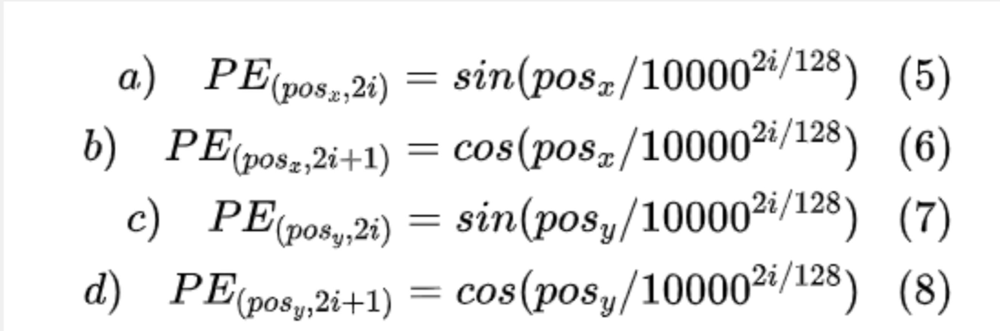

# DETR-annnotations
[DETR原版代码地址：https://github.com/facebookresearch/detr](https://github.com/facebookresearch/detr)
基于开源仓库基础上加了一些注释 [detr-annotations:https://github.com/HuKai97/detr-annotations](https://github.com/HuKai97/detr-annotations)

detr的中文注释版本

主要参考视频

[DETR源码解读1:https://www.bilibili.com/video/BV1TY4y147bH](https://www.bilibili.com/video/BV1TY4y147bH)
# 第一级数据集构建
使用coco数据集，解析coco文件并进行预处理
# 第二集搭建骨架
首先用resnet提取图像特征，调包使用resnet50
然后创建位置编码
正余弦位置编码sine
使用两个维度xy，256个hidden层各分一半
分别进行行累加和列累加，再规范化到0-2pi，然后使用下图公式来进行编码

先按照奇数偶数计算sin和cos，然后使用stack合并并展平，之后用cat连接起来并用permute重新排序，最后返回pos位置编码

# 第三集骨架搭建
搭建resnet50网络并进行前向传播，以及和位置编码合并

# 第四集